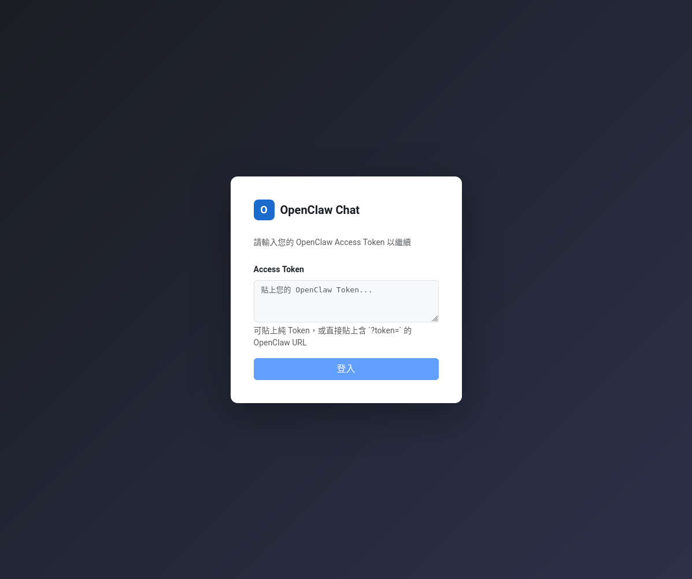
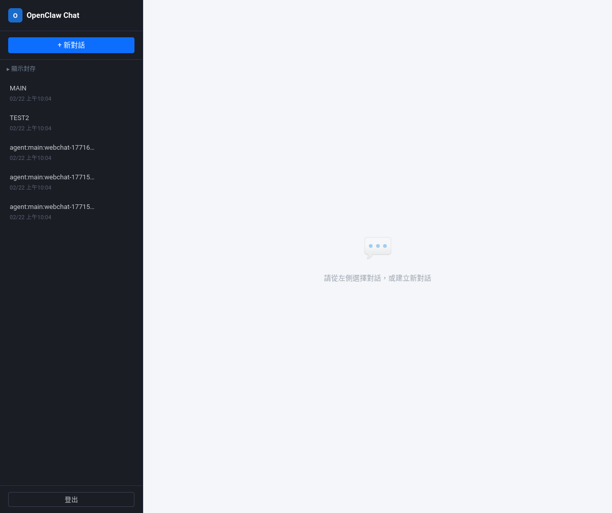
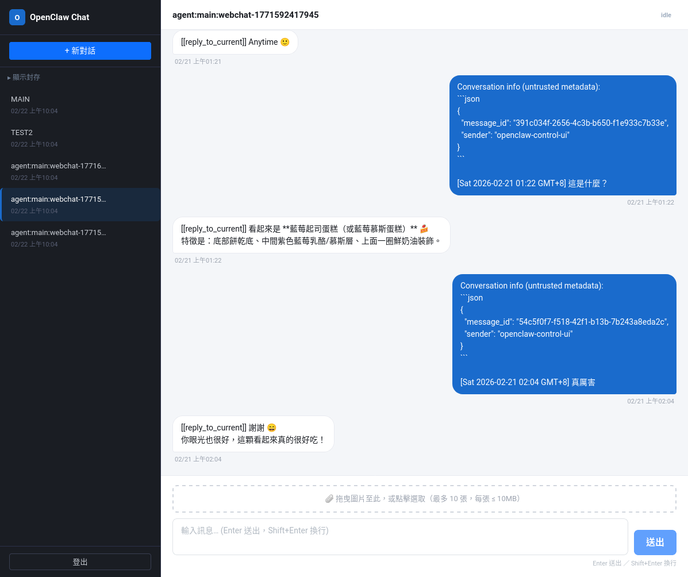

# OpenClaw Webchat Client

OpenClaw 網頁聊天客戶端 — 透過 WebSocket RPC 連接 OpenClaw Gateway 的全端 Monorepo 專案。

### 為什麼需要這個專案？

OpenClaw 內建的 Dashboard 與 Web Chat 存在以下限制：

1. **Dashboard 無法處理圖片附件** — 對話中無法上傳或顯示圖片，不適合需要視覺輔助的使用場景
2. **預設 Web Chat 僅支援單一 Session** — 無法同時管理多個對話，切換主題時必須放棄當前對話

本專案為此而生，提供**多 Session 管理**與**多圖上傳**能力，同時保持與 Gateway 的完整整合。

## 預覽

| 登入頁 | Session 清單 |
|--------|-------------|
|  |  |

| 圖片上傳對話 |
|-------------|
|  |

> **⚠️ 安全警告**
>
> 本專案使用 OpenClaw Dashboard Token 進行身份驗證，Token 等同於 Gateway 的完整操作權限。
>
> - **請勿將本服務部署於公開網路環境**（公網 IP、無 VPN 的雲端主機等）
> - 建議僅在**區域網路（LAN）**或**VPN 內網**環境中使用
> - Token 透過瀏覽器 `localStorage` 儲存，不具備 HttpOnly / Secure 等防護
> - 本專案不含使用者帳號系統與存取控制，任何取得 URL 的人皆可嘗試登入

| 套件 | 說明 | 技術棧 |
|------|------|--------|
| `apps/api` | BFF 後端（Gateway ↔ 前端中介層） | Node.js + Hono + WebSocket RPC |
| `apps/web` | 網頁前端 | Vue 3 + Bootstrap 5 + Vite |

## 功能

- Token 登入驗證（Gateway WS 握手）
- Session 管理：建立、列表、封存、關閉（刪除）、**標題內聯編輯**
- 即時對話：文字 + 多圖上傳
- 訊息串流：**持久 SSE 推播**（push）> per-request SSE > REST + polling 三層降級
- Token 過期自動登出與提示
- WS 連線池心跳保活（ping/pong 30s）

## 快速啟動

### 1. 安裝相依套件

```bash
npm install
```

### 2. 設定環境變數

```bash
cp .env.example .env
# 修改 GATEWAY_WS_URL（必填），其餘參數皆有合理預設值
```

主要設定項：

| 變數 | 必填 | 說明 |
|------|------|------|
| `GATEWAY_WS_URL` | ✅ | Gateway WebSocket 位址（`ws://` 或 `wss://`） |
| `GATEWAY_WS_ORIGIN` | wss 時需要 | WS Origin header（Gateway 校驗用） |
| `TLS_VERIFY` | 自簽憑證時 | 設為 `false` 以接受自簽憑證 |
| `CORS_ORIGINS` | 視環境 | AP 端 CORS 允許來源 |

完整清單見 [`.env.example`](.env.example)。

### 3. 啟動開發服務

```bash
# 分別在兩個終端執行
npm run dev:api   # 後端 AP，預設 http://localhost:3000
npm run dev:web   # 前端 Dev Server，預設 http://localhost:5174
```

瀏覽器開啟 `http://localhost:5174`，輸入 Gateway Token 即可登入。

### 4. 正式建置

```bash
npm run build        # 同時建置 API + Web
npm run start:api    # 啟動正式 AP（node dist/index.js）
```

產物位置：
- `apps/api/dist/` — Node.js AP
- `apps/web/dist/` — 靜態前端檔案（需另行部署）

## 架構

```
瀏覽器（Vue 3）
  │  HTTP / SSE
  ▼
AP 端（Hono, port 3000）
  ├─ rpc-client.ts       低階 WS RPC（heartbeat、事件訂閱）
  ├─ gateway-rpc.ts      連線池 + request + sendStream
  ├─ session-manager.ts  業務邏輯（CRUD、rename、archive）
  ├─ event-forwarder.ts  持久事件轉發（Gateway → SSE 推播）
  └─ routes/*            HTTP 路由
       │  WebSocket（JSON RPC）
       ▼
OpenClaw Gateway
```

### 傳輸模式

| 優先順序 | 模式 | 說明 |
|----------|------|------|
| 1（主路徑） | **push** | 持久 SSE 在線時，REST 發送 + 推播接收 chunk |
| 2（次要） | **stream** | 持久 SSE 離線時，per-request SSE 串流 |
| 3（保底） | **fallback** | REST 發送 + polling（2s 間隔，最長 30s） |

### Gateway RPC 方法

| 操作 | RPC method | params |
|------|-----------|--------|
| 取得清單 | `sessions.list` | — |
| 建立 Session | `sessions.reset` | `{ key }` |
| 更新標題 | `sessions.patch` | `{ key, label }` |
| 刪除 Session | `sessions.delete` | `{ key }` |
| 批次刪除 | `sessions.deleteMany` | `{ keys }` |
| 取得訊息 | `chat.history` | `{ sessionKey, limit }` |
| 發送訊息 | `chat.send` | `{ sessionKey, message, deliver, idempotencyKey, attachments }` |

## Gateway Origin 白名單設定

Gateway 需將前端來源加入 `controlUi.allowedOrigins` 白名單：

```bash
# 新增白名單
openclaw config set gateway.controlUi.allowedOrigins \
  '["http://localhost:5174"]'

# 確認設定
openclaw config get gateway.controlUi.allowedOrigins

# 重啟 Gateway 生效
openclaw gateway restart
```

> 正式環境請將 `localhost` 替換為實際部署的前端網域。

## 已知限制

- **封存狀態不持久**：存於 AP in-memory，AP 重啟後重置（Gateway 無原生 archive RPC）
- **串流事件格式為推測值**：`chat.stream` / `chat.chunk` 名稱與 payload 需依 Gateway 實際規格調整
- **圖片以 base64 傳送**：若 Gateway 期待二進位 WS frame，需調整 `rpc-client.ts`

## 文件

| 路徑 | 說明 |
|------|------|
| `docs/specs/spec.md` | 產品規格（功能、驗收條件、架構流程） |
| `docs/specs/plan.md` | 分階段開發計畫 |
| `docs/specs/tasks.md` | 任務拆解與完成狀態（T0–T9） |
| `docs/specs/data-model.md` | TypeScript 型別、API 端點、SSE 事件格式 |
| `docs/specs/implementation-report.md` | 各階段實作報告 |
| `docs/specs/fix-report.md` | 修正紀錄（WS 協議迭代） |
| `docs/CLAUDE.LOG/` | AI 開發日誌 |
